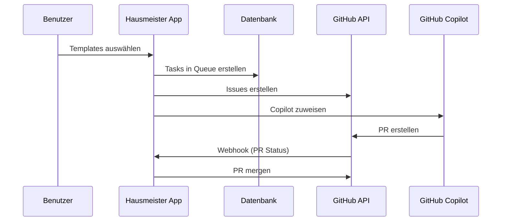
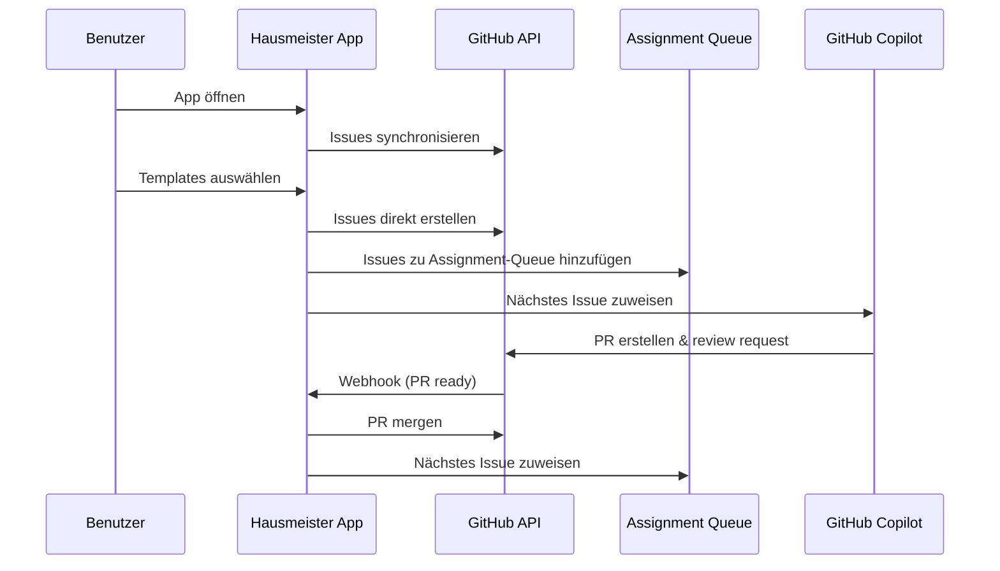

# Issue Workflow Plan - GitHub Hausmeister

## Überblick

Dieses Dokument beschreibt den Plan zur Erweiterung des GitHub Hausmeister um eine verbesserte Issue-Verwaltung mit GitHub als Single Source of Truth, Meilenstein-Sortierung und angepasstem Workflow.

## Aktuelle Implementierung (Bestandsanalyse)

### Vorhandene Komponenten

1. **Issue-Verwaltung (server/routes.ts)**:
   - Route: `/api/repositories/:owner/:repo/issues`
   - Lädt offene Issues + letzte 10 geschlossene Issues
   - Prüft PR-Status für jedes Issue
   - Zeigt Issue-Daten mit PR-Informationen an

2. **Task-Erstellung (client/src/components/TaskCreationForm.tsx)**:
   - Benutzer wählt Repository und Templates
   - Erstellt Tasks in der Datenbank-Queue
   - Templates werden zu GitHub Issues konvertiert

3. **Queue-Verarbeitung (server/lib/queue.ts)**:
   - Verarbeitet Tasks einzeln mit monatlichen Limits
   - Erstellt GitHub Issues aus Tasks
   - Weist Copilot-Agenten zu
   - Überwacht PR-Status via Webhooks

4. **Issue-Anzeige (client/src/components/IssueList.tsx)**:
   - Zeigt offene und geschlossene Issues
   - Copilot-Zuweisung möglich
   - Tabs für offene/geschlossene Issues

### Aktueller Workflow



## Identifizierte Probleme

1. **Keine Synchronisation**: App-State kann von GitHub-State abweichen
2. **Fehlende Meilenstein-Unterstützung**: Issues nicht nach Milestones sortierbar
3. **Begrenzte Closed Issues**: Nur 10 statt geforderte 5 letzte geschlossene Issues
4. **Keine Priorisierung**: Offene Issues können nicht für Zuweisung priorisiert werden
5. **Doppelte Datenquellen**: App-Queue und GitHub Issues sind nicht synchronisiert

## Geplante Erweiterungen

### 1. GitHub-Synchronisation beim App-Start

**Implementierung**:
- Neue API-Funktion: `syncRepositoryIssues(owner, repo)`
- Beim Repository-Aufruf: Abgleich zwischen lokaler DB und GitHub
- GitHub als Single Source of Truth etablieren

**Betroffene Dateien**:
- `server/lib/github-rest.ts`: Neue Sync-Funktionen
- `server/routes.ts`: Sync-Endpoint hinzufügen
- `client/src/lib/api.ts`: Client-seitige Sync-Funktionen

### 2. Meilenstein-Unterstützung

**Implementierung**:
- Issue-Liste um Meilenstein-Filter erweitern
- Sortierung nach Milestones ermöglichen
- Meilenstein-Info in Issue-Anzeige integrieren

**Betroffene Dateien**:
- `server/lib/github-rest.ts`: Meilenstein-Daten laden
- `client/src/components/IssueList.tsx`: Meilenstein-Filter UI
- `shared/schema.ts`: Meilenstein-Felder ergänzen

### 3. Issue-Priorisierung

**Implementierung**:
- Drag-and-Drop für offene Issues
- Prioritäts-Reihenfolge in lokaler DB speichern
- Bei Copilot-Zuweisung Priorität beachten

**Betroffene Dateien**:
- `client/src/components/IssueList.tsx`: Drag-and-Drop UI
- `shared/schema.ts`: Prioritäts-Feld hinzufügen
- `server/routes.ts`: Priority-Update Endpoint

### 4. Angepasster Workflow

**Neuer Workflow**:


## Implementierungsplan

### Phase 1: GitHub-Synchronisation
- [ ] Sync-Funktionen in `github-rest.ts` implementieren
- [ ] Sync-API-Endpoint in `routes.ts` hinzufügen
- [ ] Client-seitige Sync-Integration in `IssueList.tsx`
- [ ] Automatischer Sync beim Repository-Aufruf

### Phase 2: Meilenstein-Support
- [ ] Meilenstein-Daten in Issue-Abfrage integrieren
- [ ] Filter-UI für Milestones implementieren
- [ ] Meilenstein-Anzeige in Issue-Karten

### Phase 3: Issue-Priorisierung
- [ ] Prioritäts-Schema in Datenbank erweitern
- [ ] Drag-and-Drop UI implementieren
- [ ] Priority-Update API-Endpoints
- [ ] Priorität in Assignment-Logik berücksichtigen

### Phase 4: Workflow-Anpassung
- [ ] Direkte Issue-Erstellung aus Templates
- [ ] Assignment-Queue vom Task-System trennen
- [ ] Webhook-Behandlung für PR-Status aktualisieren
- [ ] Auto-Assignment nach PR-Merge implementieren

## Technische Details

### Neue API-Endpoints
```typescript
// GitHub-Synchronisation
GET /api/repositories/:owner/:repo/sync
POST /api/repositories/:owner/:repo/sync

// Issue-Priorisierung  
PUT /api/repositories/:owner/:repo/issues/priority
GET /api/repositories/:owner/:repo/issues/priority

// Erweiterte Issue-Abfrage
GET /api/repositories/:owner/:repo/issues?milestone=<milestone>&limit=5
```

### Datenbank-Erweiterungen
```sql
-- Issue-Prioritäten
CREATE TABLE issue_priorities (
  id UUID PRIMARY KEY DEFAULT gen_random_uuid(),
  user_id VARCHAR NOT NULL REFERENCES users(id),
  repository_id VARCHAR NOT NULL REFERENCES user_repositories(id),
  issue_number INTEGER NOT NULL,
  priority INTEGER NOT NULL DEFAULT 0,
  created_at TIMESTAMP DEFAULT NOW(),
  updated_at TIMESTAMP DEFAULT NOW()
);
```

### UI-Komponenten-Erweiterungen
- `MilestoneFilter.tsx`: Filter für Milestones
- `DraggableIssueList.tsx`: Drag-and-Drop für Issues
- `SyncIndicator.tsx`: Sync-Status-Anzeige

## Erfolgskriterien

1. ✅ **GitHub Single Source of Truth**: App-State synchronisiert sich automatisch mit GitHub
2. ✅ **Meilenstein-Sortierung**: Issues können nach Milestones gefiltert und sortiert werden
3. ✅ **5 letzte geschlossene Issues**: Anzeige der letzten 5 (nicht 10) geschlossenen Issues
4. ✅ **Issue-Priorisierung**: Offene Issues können für Assignment-Reihenfolge priorisiert werden
5. ✅ **Optimierter Workflow**: Direkte Issue-Erstellung und Queue-basierte Assignment

## Risiken und Mitigation

### Risiko: Performance bei großen Repositories
**Mitigation**: Paginierung und Caching für Issue-Listen implementieren

### Risiko: Race Conditions bei Assignment
**Mitigation**: Locking-Mechanismus für Assignment-Queue

### Risiko: GitHub API Rate Limits
**Mitigation**: Intelligent Rate Limiting und Exponential Backoff

## Nächste Schritte

1. **Implementierung Phase 1**: GitHub-Synchronisation als Foundation
2. **Testing**: Umfangreiche Tests für Sync-Funktionalität
3. **Incremental Rollout**: Phasenweise Einführung der Funktionen
4. **User Feedback**: Sammeln von Feedback nach jeder Phase
5. **Monitoring**: Überwachung der Performance und GitHub API Usage

---

*Erstellt am: [Aktuelles Datum]*  
*Version: 1.0*  
*Status: Planung*