# GitHub Hausmeister - Architektur-Dokumentation

**Über arc42**

arc42, das Template zur Dokumentation von Software- und
Systemarchitekturen.

Template Version 8.2 DE. (basiert auf AsciiDoc Version), Januar 2023

Created, maintained and © by Dr. Peter Hruschka, Dr. Gernot Starke and
contributors. Siehe <https://arc42.org>.

# Einführung und Ziele

## Aufgabenstellung

GitHub Hausmeister ist eine automatisierte GitHub-Wartungsanwendung, die Repository-Wartung durch das Erstellen von Chore-Issues, deren Zuweisung an GitHub Copilot-Agenten und das automatische Mergen von Pull Requests nach CI-Validierung optimiert. Die Anwendung stellt ein zentralisiertes Dashboard zur Überwachung automatisierter Wartungsaufgaben über mehrere Repositories hinweg mit konfigurierbaren monatlichen Limits und Einzelaufgaben-Nebenläufigkeitskontrollen bereit.

### Kernfunktionen

- **Automatisierte Issue-Erstellung**: Erstellt Wartungsaufgaben (Tests, Linting, Types, Sicherheitsupdates) für ausgewählte Repositories
- **Copilot-Integration**: Weist automatisch GitHub Copilot-Agenten zu Issues über die GraphQL API zu
- **CI-Überwachung**: Überwacht Pull Requests und genehmigt/merged automatisch, wenn CI erfolgreich ist
- **Webhook-Integration**: Echtzeitbehandlung von GitHub-Events (Issues, PRs, CI-Abschluss)
- **Task Queue Management**: Einzelaufgaben-Nebenläufigkeit mit konfigurierbaren monatlichen Limits
- **Mobile-First UI**: Dunkles GitHub-themed Dashboard für Überwachung und Kontrolle

## Qualitätsziele

| Priorität | Qualitätsziel              | Szenario                                                        |
| --------- | -------------------------- | --------------------------------------------------------------- |
| 1         | **Zuverlässigkeit**        | System muss GitHub Webhooks ohne Verlust verarbeiten            |
| 2         | **Skalierbarkeit**         | Unterstützung mehrerer Benutzer und Repositories                |
| 3         | **Benutzerfreundlichkeit** | Mobile-first responsive Design                                  |
| 4         | **Sicherheit**             | Sichere GitHub Token-Authentifizierung und Webhook-Verifikation |
| 5         | **Wartbarkeit**            | Modulare Architektur mit klarer Trennung der Concerns           |

## Stakeholder

| Rolle                    | Kontakt          | Erwartungshaltung                                                     |
| ------------------------ | ---------------- | --------------------------------------------------------------------- |
| **Entwickler**           | Repository Owner | Automatisierung von Repository-Wartungsaufgaben                       |
| **GitHub Copilot**       | AI Agent         | Empfang und Bearbeitung zugewiesener Issues                           |
| **CI/CD System**         | GitHub Actions   | Bereitstellung von Build-Status für automatische Merge-Entscheidungen |
| **System Administrator** | DevOps Team      | Überwachung der Anwendungsleistung und -integrität                    |

# Randbedingungen

## Technische Randbedingungen

| Constraint              | Beschreibung                                 |
| ----------------------- | -------------------------------------------- |
| **Deployment Platform** | Replit mit integriertem Secrets Management   |
| **Database**            | PostgreSQL (Neon Serverless)                 |
| **GitHub API Limits**   | Rate Limiting durch GitHub REST/GraphQL APIs |
| **Node.js Runtime**     | ES Modules, TypeScript-first Entwicklung     |

## Organisatorische Randbedingungen

| Constraint                  | Beschreibung                                                            |
| --------------------------- | ----------------------------------------------------------------------- |
| **Repository Access**       | Erfordert GitHub Personal Access Tokens mit spezifischen Berechtigungen |
| **Monthly Task Limits**     | Konfigurierbare Limits zur Verhinderung von API Rate Limiting           |
| **Single Task Concurrency** | Nur eine aktive Aufgabe gleichzeitig zur Konfliktverhinderung           |

## Konfiguration und Umgebungsvariablen

### Erforderliche Environment Variables (Replit Secrets)

| Variable                | Beschreibung                                                                              | Beispielwert                | Erforderlich      |
| ----------------------- | ----------------------------------------------------------------------------------------- | --------------------------- | ----------------- |
| `GITHUB_TOKEN`          | GitHub Personal Access Token mit repo, workflow, admin:repo_hook, read:org Berechtigungen | `ghp_xxxxxxxxxxxxx`         | ✅                |
| `GITHUB_WEBHOOK_SECRET` | Secret für GitHub Webhook-Signatur-Verifikation                                           | `super_secret_webhook_key`  | ✅                |
| `COPILOT_ACTOR_ID`      | NodeID des GitHub Copilot Coding Agents (optional)                                        | `MDQ6VXNlcjxxxxxxxxx`       | ❌                |
| `OWNER`                 | GitHub Benutzer oder Organisation                                                         | `mein-github-user-oder-org` | ✅                |
| `REPOSITORIES`          | Komma-getrennte Liste der zu verwaltenden Repositories                                    | `repo1,repo2,repo3`         | ✅                |
| `MAX_MONTHLY_TASKS`     | Maximale Anzahl Tasks pro Monat                                                           | `50`                        | ❌ (Standard: 50) |

### Dateisystem-Struktur

Das System verwendet eine spezifische Verzeichnisstruktur, die sowohl die ursprünglich geplante Next.js Struktur als auch die aktuelle React + Express.js Implementierung widerspiegelt:

```
Geplante Struktur (aus ursprünglichem Design):
/app
  /ui
    page.tsx
    components/StatusCard.tsx
    components/RepoPicker.tsx
/app/api
  /webhook/route.ts
  /issues/create/route.ts
  /tasks/start/route.ts
  /tasks/status/route.ts
  /tasks/approve-merge/route.ts
/lib
  github-rest.ts
  github-graphql.ts
  queue.ts
  state.ts
  ci.ts
  copilot.ts
  webhook-verify.ts

Aktuelle Implementierung:
/client/src/           # React Frontend
/server/              # Express.js Backend
  /lib/               # Business Logic Module
  /routes.ts          # API Route Handlers
/shared/              # Gemeinsame TypeScript Types
/data/                # Persistente State Files
  state.json
  deliveries.json
```

# Kontextabgrenzung

## Fachlicher Kontext

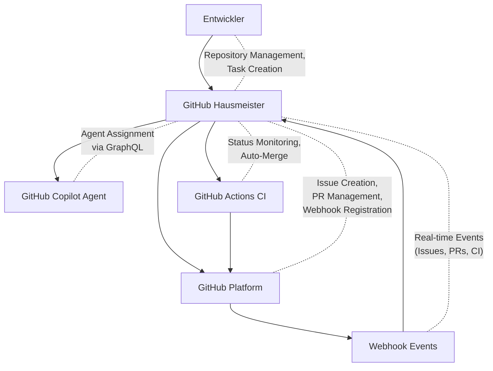

**Externe fachliche Schnittstellen:**

- **GitHub Platform**: Repository-Operationen, Issue/PR-Management, Webhook-Events
- **GitHub Copilot**: Automatische Agent-Zuweisung für Wartungsaufgaben
- **GitHub Actions**: CI-Status-Überwachung und automatische Merge-Operationen

## Technischer Kontext

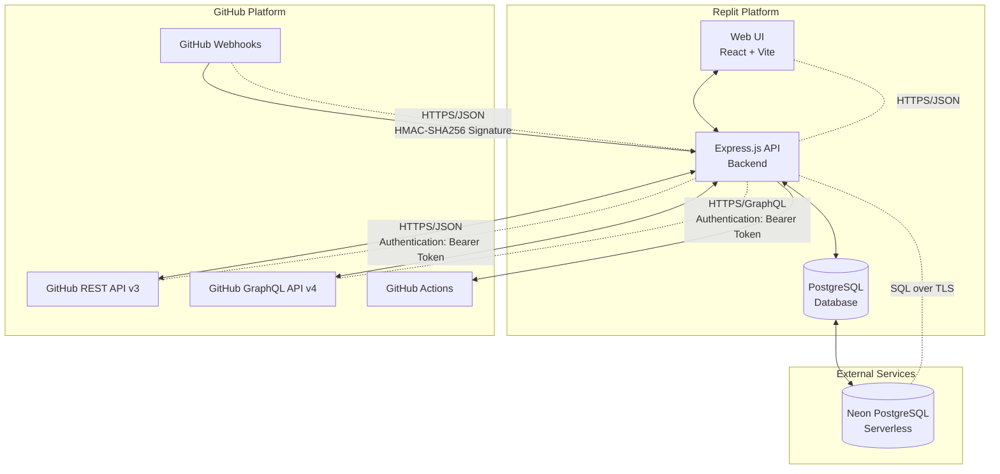

**Technische Schnittstellen:**

- **GitHub REST API v3**: Repository-Management, Issue/PR-Operationen, Webhook-Registrierung
- **GitHub GraphQL API v4**: Copilot-Agent-Zuweisung und erweiterte Abfragen
- **GitHub Webhooks**: Echtzeitverarbeitung von Events mit HMAC-SHA256-Verifikation
- **PostgreSQL via Drizzle ORM**: Typsichere Datenbankoperationen

# Lösungsstrategie

## Architekturmuster

| Aspekt                   | Entscheidung                                | Begründung                                                                            |
| ------------------------ | ------------------------------------------- | ------------------------------------------------------------------------------------- |
| **Frontend-Architektur** | React + TypeScript + Vite                   | Schnelle Entwicklungserfahrung, optimiertes Bundling                                  |
| **Backend-Architektur**  | Express.js RESTful API                      | Bewährtes Node.js Framework mit klarer API-Struktur                                   |
| **Daten-Persistierung**  | Hybrid: PostgreSQL + In-Memory + File-State | PostgreSQL für dauerhafte Daten, In-Memory für Queue, JSON-Files für kritischen State |
| **GitHub Integration**   | REST + GraphQL APIs                         | REST für Standard-Operationen, GraphQL für Copilot-spezifische Features               |
| **Task Management**      | Single-Task Queue mit Persistierung         | Verhindert Konflikte, einfache Implementierung                                        |

## Technologie-Entscheidungen

| Bereich              | Technologie          | Begründung                                      |
| -------------------- | -------------------- | ----------------------------------------------- |
| **UI Framework**     | shadcn/ui + Radix UI | Zugänglichkeit, konsistentes Design System      |
| **State Management** | TanStack Query       | Server State Management, Caching, Data Fetching |
| **Routing**          | Wouter               | Leichtgewichtige Alternative zu React Router    |
| **Styling**          | Tailwind CSS         | Utility-first, mobile-first responsive Design   |
| **ORM**              | Drizzle ORM          | Type-safe, schema-first Datenbankoperationen    |

## Implementierungsdetails

### GitHub GraphQL Integration für Copilot-Zuweisung

Das System verwendet eine spezielle Strategie für die Copilot-Agent-Zuweisung:

**Strategie**: Wenn `COPILOT_ACTOR_ID` in den Umgebungsvariablen gesetzt ist, wird diese direkt verwendet. Andernfalls versucht das System, die Copilot-Agent-ID via GraphQL zu ermitteln. Bei Fehlschlag wird ein klarer Fehlerhinweis ausgegeben.

#### GraphQL Client Implementation

```typescript
// lib/github-graphql.ts (Referenzimplementierung)
import fetch from 'node-fetch';

const GQL = 'https://api.github.com/graphql';
const TOKEN = process.env.GITHUB_TOKEN!;

export async function gql<T>(
  query: string,
  variables: Record<string, any> = {}
): Promise<T> {
  const res = await fetch(GQL, {
    method: 'POST',
    headers: {
      Authorization: `Bearer ${TOKEN}`,
      'Content-Type': 'application/json',
    },
    body: JSON.stringify({ query, variables }),
  });
  if (!res.ok)
    throw new Error(`GraphQL HTTP ${res.status}: ${await res.text()}`);
  const json = await res.json();
  if (json.errors)
    throw new Error(`GraphQL errors: ${JSON.stringify(json.errors)}`);
  return json.data as T;
}
```

#### Copilot-Agent-Ermittlung und Zuweisung

```typescript
// lib/copilot.ts (Referenzimplementierung)
import { gql } from './github-graphql';

export async function getCopilotNodeId(): Promise<string> {
  const configured = process.env.COPILOT_ACTOR_ID;
  if (configured && configured.trim()) return configured.trim();

  // Fallback: GraphQL-Suche nach Copilot-Agenten
  const query = `
    query($login: String!) {
      user(login: $login) { id login }
      organization(login: $login) { id login }
    }`;

  const candidates = ['copilot', 'github-copilot', 'copilot-swe-agent'];
  for (const login of candidates) {
    try {
      const data: any = await gql(query, { login });
      if (data?.user?.id) return data.user.id;
      if (data?.organization?.id) return data.organization.id;
    } catch {}
  }
  throw new Error(
    'COPILOT_ACTOR_ID nicht konfiguriert und Copilot-Agent-ID nicht auffindbar. Bitte .env setzen.'
  );
}

export async function addAssignee(issueNodeId: string, assigneeNodeId: string) {
  const mutation = `
    mutation($assignableId: ID!, $assigneeIds: [ID!]!) {
      addAssigneesToAssignable(input: {assignableId: $assignableId, assigneeIds: $assigneeIds}) {
        assignable { ... on Issue { id number title } }
      }
    }`;
  return gql(mutation, {
    assignableId: issueNodeId,
    assigneeIds: [assigneeNodeId],
  });
}
```

### CI-Status-Überprüfung

```typescript
// lib/ci.ts (Referenzimplementierung)
import { octokit } from './github-rest';

export async function isPRGreen(owner: string, repo: string, sha: string) {
  // Kombiniert Status Checks und Check Runs für vollständige CI-Validierung
  const [statusRes, checksRes] = await Promise.all([
    octokit.rest.repos.getCombinedStatusForRef({ owner, repo, ref: sha }),
    octokit.rest.checks.listForRef({ owner, repo, ref: sha }),
  ]);

  const allStatusesOk = statusRes.data.state === 'success';
  const allChecksOk = checksRes.data.check_runs.every(
    (cr) => cr.conclusion === 'success'
  );
  return allStatusesOk && allChecksOk;
}
```

### REST API Operationen

#### GitHub REST Client (Octokit-basiert)

```typescript
// lib/github-rest.ts (Referenzimplementierung)
import { Octokit } from 'octokit';

export const octokit = new Octokit({ auth: process.env.GITHUB_TOKEN });

export async function createIssue(
  owner: string,
  repo: string,
  title: string,
  body: string,
  labels: string[] = []
) {
  const { data } = await octokit.rest.issues.create({
    owner,
    repo,
    title,
    body,
    labels,
  });
  return data; // includes number, id, node_id
}

export async function getIssue(
  owner: string,
  repo: string,
  issue_number: number
) {
  return (await octokit.rest.issues.get({ owner, repo, issue_number })).data;
}

export async function createReviewApprove(
  owner: string,
  repo: string,
  pull_number: number,
  body = 'LGTM (auto)'
) {
  return octokit.rest.pulls.createReview({
    owner,
    repo,
    pull_number,
    event: 'APPROVE',
    body,
  });
}

export async function mergePullRequest(
  owner: string,
  repo: string,
  pull_number: number,
  method: 'merge' | 'squash' | 'rebase' = 'squash'
) {
  return octokit.rest.pulls.merge({
    owner,
    repo,
    pull_number,
    merge_method: method,
  });
}

export async function listPRsForIssue(
  owner: string,
  repo: string,
  issue_number: number
) {
  // PRs referenzieren das Issue per „Closes #<nr>"; alternativ: search
  const { data } = await octokit.rest.search.issuesAndPullRequests({
    q: `repo:${owner}/${repo} type:pr in:body is:open "${`#${issue_number}`}"`,
  });
  return data.items;
}
```

### State Management und Queue-System

#### State-Datenstruktur

```typescript
// lib/state.ts (Referenzimplementierung)
import fs from 'fs';
import path from 'path';

const p = path.join(process.cwd(), 'data/state.json');

type State = {
  monthlyDone: number;
  activeTask?: {
    owner: string;
    repo: string;
    issueNumber: number;
    pullNumber?: number;
    headSha?: string;
  };
  queue: Array<{
    owner: string;
    repo: string;
    title: string;
    body: string;
    labels: string[];
  }>;
};

const DEFAULT_STATE: State = { monthlyDone: 0, queue: [] };

export function loadState(): State {
  try {
    return JSON.parse(fs.readFileSync(p, 'utf8'));
  } catch {
    return DEFAULT_STATE;
  }
}

export function saveState(s: State) {
  fs.mkdirSync(path.dirname(p), { recursive: true });
  fs.writeFileSync(p, JSON.stringify(s, null, 2));
}
```

#### Single-Task Queue Management

```typescript
// lib/queue.ts (Referenzimplementierung)
import { loadState, saveState } from './state';
import { createIssue } from './github-rest';
import { getCopilotNodeId, addAssignee } from './copilot';

export async function startNextIfIdle() {
  const s = loadState();
  if (s.activeTask || s.queue.length === 0) return;

  const max = Number(process.env.MAX_MONTHLY_TASKS || 50);
  if (s.monthlyDone >= max) return;

  const job = s.queue.shift()!;
  // 1) Issue erstellen
  const issue = await createIssue(
    job.owner,
    job.repo,
    job.title,
    job.body,
    job.labels
  );
  // 2) Copilot zuweisen (GraphQL)
  const copilotId = await getCopilotNodeId();
  await addAssignee(issue.node_id, copilotId);

  s.activeTask = {
    owner: job.owner,
    repo: job.repo,
    issueNumber: issue.number,
  };
  saveState(s);
}

export function markDoneAndContinue() {
  const s = loadState();
  s.activeTask = undefined;
  s.monthlyDone += 1;
  saveState(s);
  // Nächster Start asynchron
  setTimeout(() => {
    startNextIfIdle().catch(console.error);
  }, 1000);
}
```

### Webhook-Verarbeitung und Signatur-Verifikation

#### HMAC-SHA256 Signatur-Verifikation

```typescript
// lib/webhook-verify.ts (Referenzimplementierung)
import crypto from 'crypto';

export function verifySignature(
  secret: string,
  payload: string,
  sig256: string | undefined
) {
  const hmac = crypto.createHmac('sha256', secret);
  const digest = `sha256=${hmac.update(payload).digest('hex')}`;
  return crypto.timingSafeEqual(Buffer.from(digest), Buffer.from(sig256 || ''));
}
```

#### Webhook-Handler-Struktur

Das System verarbeitet folgende GitHub-Events:

- **`issues`** (assigned): Wenn Issues zugewiesen werden
- **`pull_request`** (opened, ready_for_review, reopened): PR-Lifecycle-Events
- **`check_suite.completed`** / **`workflow_run.completed`**: CI-Abschluss-Events

**Grundlegendes Webhook-Processing-Pattern**:

1. Signatur-Verifikation mit `GITHUB_WEBHOOK_SECRET`
2. Duplikat-Erkennung via `X-GitHub-Delivery` Header
3. Event-spezifische Verarbeitung basierend auf `X-GitHub-Event`
4. State-Update und Queue-Management
5. Automatische Weiterverarbeitung (Issue → PR → CI → Merge)

### Chore-Task-Templates

Das System verwendet vordefinierte Templates für verschiedene Wartungsaufgaben:

```typescript
const templates = [
  {
    title: 'Tests nachziehen (kritische Pfade)',
    body: 'Bitte Unit Tests für Kernfunktionen ergänzen. Ziel: Abdeckung +10%. Closes after CI green.',
    labels: ['chore', 'tests'],
  },
  {
    title: 'Lint/Format Fehler beheben',
    body: 'Bitte eslint/prettier-Probleme lösen und CI grün machen.',
    labels: ['chore', 'lint'],
  },
  {
    title: 'Types härten (strict/tsconfig)',
    body: 'Bitte TypeScript-Fehler reduzieren; keine suppressions. CI muss grün sein.',
    labels: ['chore', 'types'],
  },
];
```

### GitHub Actions CI-Workflow (Ziel-Repository)

Jedes verwaltete Repository benötigt folgenden CI-Workflow:

```yaml
# .github/workflows/ci.yml
name: CI
on:
  pull_request:
    branches: [main]
jobs:
  node:
    runs-on: ubuntu-latest
    steps:
      - uses: actions/checkout@v4
      - uses: actions/setup-node@v4
        with: { node-version: 20, cache: 'npm' }
      - run: npm ci
      - run: npm run build
      - run: npm test --if-present
```

# Bausteinsicht

## Whitebox Gesamtsystem

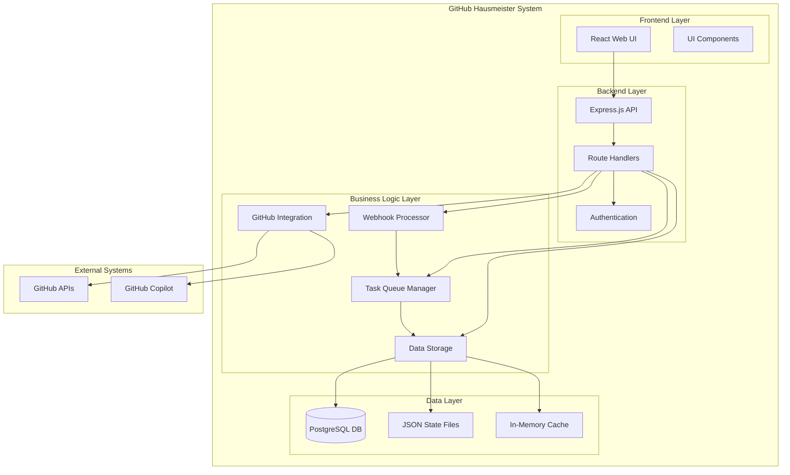

**Begründung**: Das System folgt einer klassischen 3-Schichten-Architektur mit klarer Trennung von Präsentation, Geschäftslogik und Datenhaltung. Die Hybrid-Speicherstrategie optimiert Performance und Persistierung.

**Enthaltene Bausteine**:

- **Frontend Layer**: React-basierte Benutzeroberfläche
- **Backend Layer**: Express.js API mit Authentifizierung
- **Business Logic Layer**: Kerngeschäftslogik für Task Management und GitHub Integration
- **Data Layer**: Hybride Speicherlösung für verschiedene Datentypen

**Wichtige Schnittstellen**:

- **REST API**: Frontend-Backend Kommunikation
- **GitHub APIs**: Externe Integration für Repository-Management
- **Webhook Interface**: Eingehende GitHub-Events

### Frontend Layer

**Zweck/Verantwortung**: Bereitstellung einer responsiven Web-Oberfläche für Repository-Management, Task-Überwachung und Systemkontrolle.

**Schnittstelle(n)**:

- REST API Client über `/api/*` Endpoints
- WebSocket-Verbindung für Real-time Updates (geplant)

**Qualitäts-/Leistungsmerkmale**:

- Mobile-first responsive Design
- Dark Theme entsprechend GitHub-Styling
- Client-side Routing mit Wouter
- Optimistische Updates über TanStack Query

**Ablageort/Datei(en)**: `client/src/`, `components.json`, `vite.config.ts`

### Backend Layer

**Zweck/Verantwortung**: Bereitstellung einer RESTful API für Frontend-Kommunikation, Authentifizierung und Request-Routing.

**Schnittstelle(n)**:

- HTTP REST API auf Port 3000
- Session-basierte Authentifizierung
- GitHub OAuth Integration

**Qualitäts-/Leistungsmerkmale**:

- Express.js mit TypeScript
- Session Management über PostgreSQL
- Request/Response Logging
- Error Handling Middleware

**Ablageort/Datei(en)**: `server/index.ts`, `server/routes.ts`

### Business Logic Layer

**Zweck/Verantwortung**: Implementierung der Kerngeschäftslogik für Task Management, GitHub Integration und Webhook-Verarbeitung.

**Schnittstelle(n)**:

- Task Queue Interface
- GitHub REST/GraphQL Client
- Webhook Event Handler
- Database Storage Interface

**Ablageort/Datei(en)**: `server/lib/`

### Data Layer

**Zweck/Verantwortung**: Persistierung und Verwaltung von Anwendungsdaten über verschiedene Speichermedien.

**Schnittstelle(n)**:

- Drizzle ORM für PostgreSQL
- File System für JSON State
- In-Memory Storage für Queues

**Ablageort/Datei(en)**: `shared/schema.ts`, `server/lib/database-storage.ts`, `server/lib/state.ts`

## Ebene 2

### Whitebox Task Queue Manager

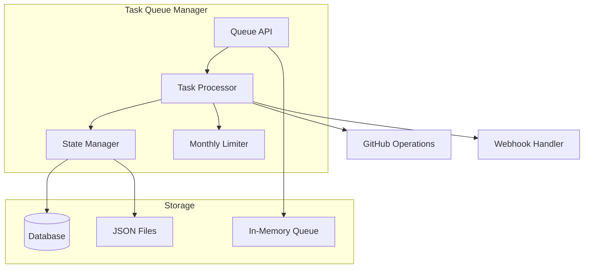

**Zweck**: Zentrale Verwaltung der Task-Warteschlange mit Einzelaufgaben-Nebenläufigkeit und monatlichen Limits.

**Schnittstellen**:

- `createTask()`: Neue Tasks zur Queue hinzufügen
- `processNext()`: Nächste Task aus der Queue verarbeiten
- `updateTaskStatus()`: Task-Status aktualisieren

**Ablageort**: `server/lib/queue.ts` (implizit in routes.ts implementiert)

### Whitebox GitHub Integration

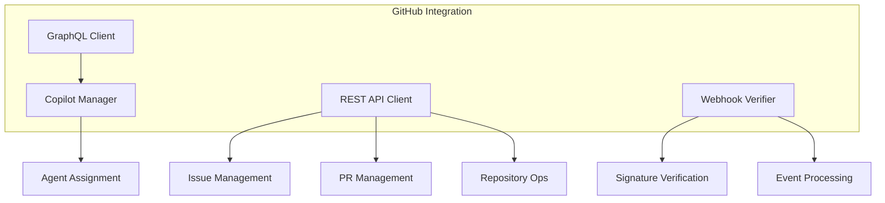

**Zweck**: Abstraktion und Management aller GitHub API-Interaktionen.

**Schnittstellen**:

- REST API für CRUD-Operationen
- GraphQL API für Copilot-Features
- Webhook-Verarbeitung mit Signatur-Verifikation

**Ablageort**: `server/lib/github-rest.ts`, `server/lib/copilot.ts`

# Laufzeitsicht

## Task Creation und Processing Workflow

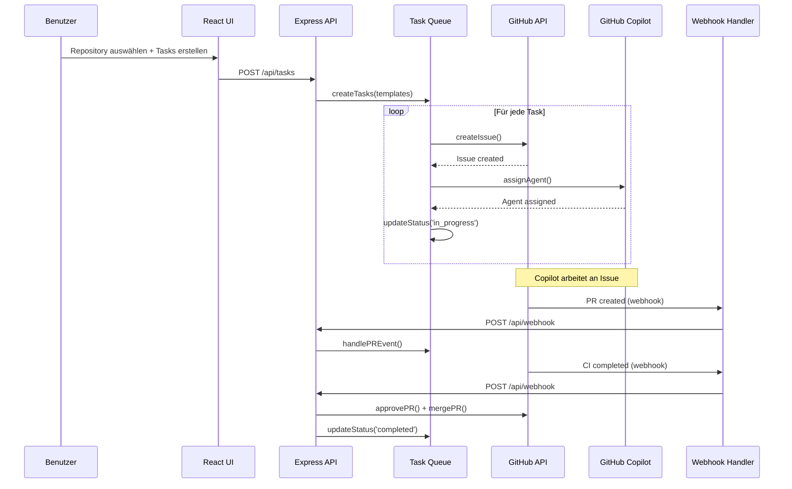

**Besonderheiten**:

- Einzelaufgaben-Verarbeitung verhindert Konflikte
- Webhook-Events triggern automatische Weiterverarbeitung
- Persistente Zustandsverfolgung über alle Schritte

## Webhook Event Processing

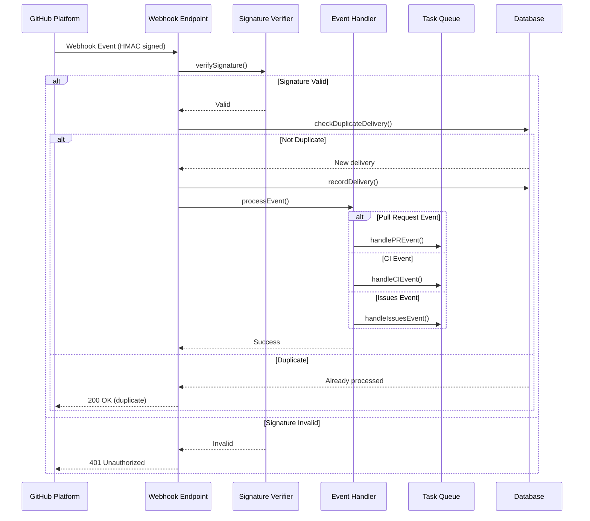

**Besonderheiten**:

- HMAC-SHA256 Signatur-Verifikation für Sicherheit
- Duplikat-Erkennung verhindert Mehrfachverarbeitung
- Event-spezifische Handler für verschiedene GitHub-Events

# Verteilungssicht

## Infrastruktur Ebene 1

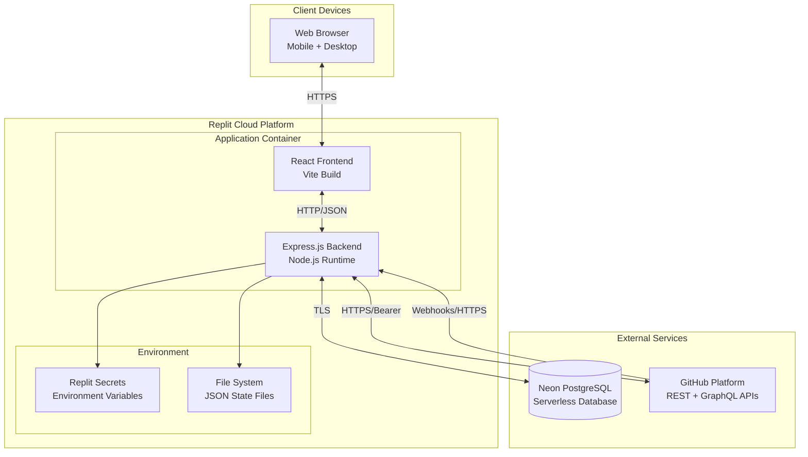

**Begründung**: Single-Container Deployment auf Replit reduziert Komplexität und Deployment-Overhead. Externe Services für Skalierbarkeit und Zuverlässigkeit.

**Qualitäts- und/oder Leistungsmerkmale**:

- **Verfügbarkeit**: Replit-Platform mit automatischem Neustart
- **Skalierbarkeit**: Serverless PostgreSQL über Neon
- **Sicherheit**: Environment Variables über Replit Secrets
- **Performance**: Client-side Caching, optimierte Builds

**Zuordnung von Bausteinen zu Infrastruktur**:

- **Frontend**: Statische Assets served von Express.js
- **Backend**: Node.js Express.js Server
- **Database**: Neon PostgreSQL mit Drizzle ORM
- **State**: JSON Files im Container File System

# Querschnittliche Konzepte

## Authentifizierung und Autorisierung

**Konzept**: OAuth-basierte Authentifizierung über GitHub mit Session Management.

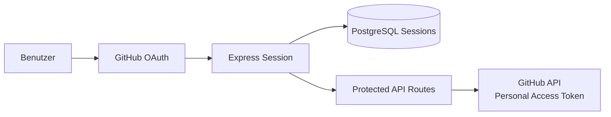

**Implementierung**:

- GitHub Personal Access Tokens für API-Zugriff
- Express Session Middleware mit PostgreSQL-Speicherung
- Route-spezifische Authentifizierung über Middleware

## Error Handling und Logging

**Konzept**: Zentrale Fehlerbehandlung mit strukturiertem Logging.

**Implementierung**:

- Try-catch Blocks in allen async Operationen
- Express Error Handling Middleware
- Console-basiertes Logging (Replit-optimiert)
- Webhook-spezifische Fehlerbehandlung mit HTTP Status Codes

## Task State Management

**Konzept**: Hybrid State Management für verschiedene Datentypen.

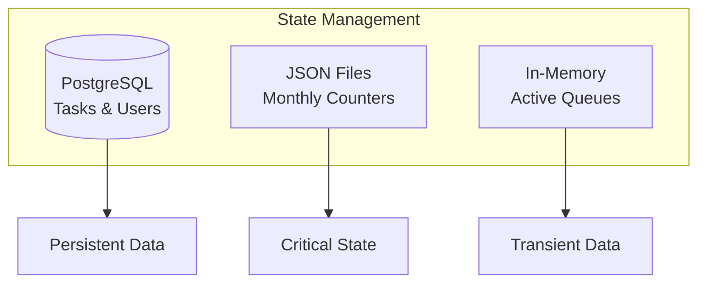

**Implementierung**:

- PostgreSQL für langfristige Datenpersistierung
- JSON Files für kritische System-State (monatliche Zähler)
- In-Memory Storage für temporäre Queue-Verwaltung

## API Rate Limiting

**Konzept**: Proaktive GitHub API Rate Limit-Verwaltung.

**Implementierung**:

- Monatliche Task-Limits (konfigurierbar, Standard: 50)
- Einzelaufgaben-Verarbeitung zur Konfliktvermeidung
- Exponential Backoff bei API-Fehlern
- Automatisches Reset der monatlichen Zähler

## Repository-Setup und Workflow-Konfiguration

### Einmalige Vorbereitung für verwaltete Repositories

Jedes Repository, das von GitHub Hausmeister verwaltet werden soll, benötigt eine einmalige Konfiguration:

#### 1. Webhook-Konfiguration

- **URL**: `https://[replit-app-url]/api/webhook`
- **Events**: `issues`, `pull_request`, `workflow_run`, `check_suite`
- **Secret**: Identisch mit `GITHUB_WEBHOOK_SECRET` Environment Variable
- **Content Type**: `application/json`

#### 2. CI-Workflow einrichten

- Datei: `.github/workflows/ci.yml` (siehe Implementierungsdetails)
- Läuft auf allen Pull Requests gegen main Branch
- Führt `npm ci`, `npm run build`, `npm test` aus

#### 3. Branch-Schutz (optional)

- **Regel**: "Require status checks before merging"
- **Status Checks**: CI Workflow als erforderlich markieren
- Ermöglicht automatische Merge-Entscheidungen basierend auf CI-Ergebnissen

#### 4. GitHub Copilot aktivieren

- Copilot Coding Agent im Repository aktivieren (über GitHub UI)
- Sicherstellen, dass der Agent Pull Requests öffnen darf
- Optional: Spezifische Agent-Konfiguration für das Repository

### Vollständiger End-to-End Workflow

1. **Task-Erstellung**: Benutzer startet "Chore-Schleife" → App füllt Queue → `startNextIfIdle()`
2. **Issue-Erstellung**: App erstellt GitHub Issue → GraphQL weist Copilot zu
3. **Copilot-Bearbeitung**: Copilot analysiert Issue und beginnt Implementierung
4. **PR-Erstellung**: Copilot öffnet Pull Request (Draft) → Webhook speichert PR-Details
5. **CI-Ausführung**: GitHub Actions startet automatisch auf PR
6. **Status-Überwachung**: Copilot markiert "ready for review" → Webhook prüft CI-Status via `isPRGreen()`
7. **Auto-Merge**: Bei grünem CI → App approved und merged PR automatisch
8. **Task-Abschluss**: `markDoneAndContinue()` startet nächste Task in der Queue
9. **Fehlerbehandlung**: Bei rotem CI → App kommentiert PR, optionale manuelle Intervention

# Architekturentscheidungen

| Entscheidung                        | Status       | Begründung                                                       | Konsequenzen                                             |
| ----------------------------------- | ------------ | ---------------------------------------------------------------- | -------------------------------------------------------- |
| **React + TypeScript für Frontend** | ✅ Umgesetzt | Type Safety, Component-basierte Architektur, große Community     | Komplexere Build-Pipeline, Lernkurve für neue Entwickler |
| **Express.js für Backend**          | ✅ Umgesetzt | Bewährtes Framework, große Middleware-Auswahl, RESTful APIs      | Weniger strukturiert als andere Frameworks               |
| **Drizzle ORM statt Prisma**        | ✅ Umgesetzt | Bessere TypeScript Integration, Schema-first Approach            | Kleinere Community, weniger Resources                    |
| **Hybrid Storage Strategy**         | ✅ Umgesetzt | Optimiert verschiedene Datentypen, Performance vs. Persistierung | Komplexere Datenverwaltung, Konsistenz-Herausforderungen |
| **Single Task Concurrency**         | ✅ Umgesetzt | Verhindert GitHub API Konflikte, einfache Implementierung        | Reduzierte Durchsatzleistung, Queue-Delays               |
| **Replit als Deployment Platform**  | ✅ Umgesetzt | Integrierte Entwicklungsumgebung, Secrets Management             | Vendor Lock-in, begrenzte Skalierungsoptionen            |
| **Wouter statt React Router**       | ✅ Umgesetzt | Reduzierte Bundle-Größe, einfache API                            | Weniger Features, kleinere Community                     |

# Qualitätsanforderungen

## Qualitätsbaum

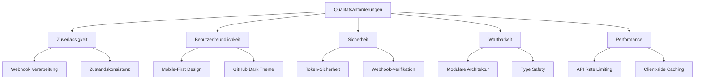

## Qualitätsszenarien

| Szenario                   | Qualitätsmerkmal       | Stimulus                            | Umgebung             | Antwort                                               | Messbare Größe                                |
| -------------------------- | ---------------------- | ----------------------------------- | -------------------- | ----------------------------------------------------- | --------------------------------------------- |
| **Webhook-Verarbeitung**   | Zuverlässigkeit        | GitHub sendet Webhook               | Produktionsumgebung  | Event wird verarbeitet und Task aktualisiert          | 99.9% Webhook Success Rate                    |
| **Mobile Nutzung**         | Benutzerfreundlichkeit | Benutzer öffnet App auf Smartphone  | Mobile Browser       | UI ist vollständig nutzbar und responsive             | Alle Features nutzbar <480px Bildschirmbreite |
| **Token-Kompromittierung** | Sicherheit             | GitHub Token wird kompromittiert    | Produktionsumgebung  | System erkennt ungültige Tokens und blockiert Zugriff | <1 Sekunde Reaktionszeit auf ungültige Tokens |
| **Code-Änderungen**        | Wartbarkeit            | Entwickler fügt neues Feature hinzu | Entwicklungsumgebung | Änderung isoliert in spezifischem Modul               | <5 Dateien pro Feature-Änderung               |
| **API Rate Limit**         | Performance            | Monatliches Limit erreicht          | Produktionsumgebung  | Neue Tasks werden blockiert bis zum nächsten Monat    | Automatischer Stop bei 50 Tasks/Monat         |

# Risiken und technische Schulden

## Risiken

| Risiko                            | Wahrscheinlichkeit | Auswirkung                 | Mitigation                                    |
| --------------------------------- | ------------------ | -------------------------- | --------------------------------------------- |
| **GitHub API Rate Limiting**      | Hoch               | System-Ausfall             | Monatliche Limits, Exponential Backoff        |
| **Webhook-Ausfall**               | Mittel             | Verpasste Events           | Retry-Mechanismus, Event-Polling als Fallback |
| **PostgreSQL Verbindungsabbruch** | Mittel             | Datenverlust               | Connection Pooling, Retry-Logic               |
| **Replit Platform Ausfall**       | Niedrig            | Kompletter Service-Ausfall | Backup Deployment Strategy                    |

## Technische Schulden

| Bereich                   | Beschreibung                               | Priorität | Geplante Lösung                            |
| ------------------------- | ------------------------------------------ | --------- | ------------------------------------------ |
| **Testing Coverage**      | Keine automatisierten Tests vorhanden      | Hoch      | Vitest Framework implementieren            |
| **CI/CD Pipeline**        | Keine automatisierte Build/Deploy Pipeline | Hoch      | GitHub Actions einrichten                  |
| **Error Monitoring**      | Nur Console-Logging vorhanden              | Mittel    | Strukturiertes Logging + Monitoring        |
| **WebSocket Integration** | Real-time Updates nur über Polling         | Niedrig   | WebSocket für Live-Updates                 |
| **Backup Strategy**       | Keine automatisierte Backups               | Mittel    | Neon PostgreSQL Backup + State File Backup |

## Bekannte Limitationen

- **Single Task Concurrency**: Reduzierte Parallelität zugunsten von Stabilität
- **Replit Vendor Lock-in**: Deployment-spezifische Konfiguration
- **File-based State**: JSON State Files nicht für High-Concurrency geeignet
- **In-Memory Queue**: Queue geht bei Neustart verloren (wird aus DB rekonstruiert)

# Glossar

| Begriff                     | Definition                                                          |
| --------------------------- | ------------------------------------------------------------------- |
| **GitHub Hausmeister**      | Automatisierte Anwendung für GitHub Repository-Wartung              |
| **Chore Issue**             | Wartungsaufgabe (Tests, Linting, Dependencies) als GitHub Issue     |
| **Copilot Agent**           | GitHub AI-Agent, der Issues automatisch bearbeitet                  |
| **Task Queue**              | Warteschlange für die sequenzielle Abarbeitung von Wartungsaufgaben |
| **Webhook**                 | HTTP-Callback von GitHub bei Repository-Events                      |
| **Single Task Concurrency** | Verarbeitung jeweils nur einer Aufgabe zur Konfliktvermeidung       |
| **Monthly Limit**           | Monatliches Kontingent für erstellte Tasks pro Benutzer             |
| **Auto-Merge**              | Automatisches Mergen von Pull Requests nach erfolgreichem CI        |
| **Rate Limiting**           | Begrenzung der API-Anfragen zur Einhaltung von GitHub-Limits        |
| **HMAC Verification**       | Kryptographische Verifikation von Webhook-Signaturen                |
| **Express Session**         | Server-seitige Session-Verwaltung für Benutzer-Authentifizierung    |
| **Drizzle ORM**             | Type-safe Object-Relational Mapping für PostgreSQL                  |
| **shadcn/ui**               | React Component Library basierend auf Radix UI                      |
| **TanStack Query**          | Library für Server State Management und Caching                     |
| **Replit Secrets**          | Environment Variable Management in der Replit Platform              |
