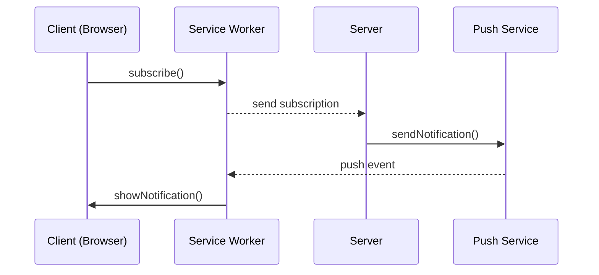

## Der Web Push Pfad



---

## Drei Akte des Zaubers

**Akt 1: Die falsche Annahme**  
Noch nie hatte ich Web Push implementiert. Ich wollte es auch nicht händisch tun, sondern ChatGPT und dem **Replit Agent** überlassen. Alles klang plausibel, alles sah sauber aus. Drei Tage später und mit halbem Monatsbudget bei Replit regenerierte ich immer noch VAPID Keys, prüfte JWT Claims und justierte Server-Configs – überzeugt, das Problem liege dort.

**Akt 2: Die Illusion**  
Drei Push-Komponenten, dieselbe Fehlermeldung: „JWT Authentication Failed“. JWT-Struktur? OK. Claims? OK. VAPID Keys? OK. Trotzdem: 401, 401, 401. Ich begann zu zweifeln – hatte mich mein eigener Automation Bias hierhin geführt oder ist es wirklich ein gängiges Problem?

> „Push Services respond with 401 Unauthorized for expired or invalid subscriptions.“ – [Pushpad Blog](https://pushpad.xyz/blog/web-push-errors-explained-with-http-status-codes)  
> „Invalid VAPID details may result in 401 Unauthorized.“ – [web.dev: Web Push Protocol](https://web.dev/articles/push-notifications-web-push-protocol)

**Akt 3: Die Hypothese (noch nicht bestätigt)**  
Dann der Blick in die Browser-Subscription:

```typescript
// validatePushSubscription.ts
export function validatePushSubscription(sub: any) {
  const authKey = Buffer.from(sub.keys.auth, 'base64url');
  if (authKey.length < 16) { // Hypothese
    return { valid: false, error: `Auth key short: ${authKey.length} bytes` };
  }
  return { valid: true };
}
```

Vielleicht generieren Browser kaputte Subscriptions (auth key <16 bytes) – und Push Services antworten mit irreführendem JWT Error. Oder ist es nur ein seltener Edge Case? Ich testete auch im Browser Edge.

---

## Der Schutzzauber

```typescript
// client/src/hooks/usePushNotifications.ts
export async function subscribeToPush(publicKey: string) {
  const registration = await navigator.serviceWorker.ready;
  return (await registration.pushManager.subscribe({
    userVisibleOnly: true,
    applicationServerKey: urlBase64ToUint8Array(publicKey)
  })).toJSON();
}

// server/routes/webpush.ts
import webpush from 'web-push';
import { validatePushSubscription } from './validatePushSubscription';

export async function sendPushNotification(subscription, payload) {
  if (!validatePushSubscription(subscription).valid) return false;
  await webpush.sendNotification(subscription, JSON.stringify(payload), { TTL: 86400 });
  return true;
}
```

---

### Die Lektion

Ich habe mich auf AI-Outputs verlassen und bekam eine plausible Story – aber vielleicht nicht die Wahrheit. **Hypothese**: Auth Key Länge <16 Bytes könnte Push Services triggern, falsche JWT Errors auszugeben. **Noch nicht bewiesen.**

Weitere nützliche Quellen:

- [Mozilla Web Push Data Test Page](https://mozilla-services.github.io/WebPushDataTestPage/)
    
- [IETF Web Push Protocol Draft](https://datatracker.ietf.org/doc/html/draft-ietf-webpush-protocol)
    

---

### Der Weg nach vorn

Ich werde händisch ein **Minimal Setup** bauen, Subscription Keys prüfen und Push Services gezielt testen. Auch, um mein Core-Budget und meine GitHub-Copilot-Tokens zu schonen. Die Tests werden zeigen, ob dies wirklich der Schlüssel ist – oder ob noch ein anderer Zauber dahintersteckt.

---

_"Vertraue den Tools – aber prüfe, was sie beschwören."_
