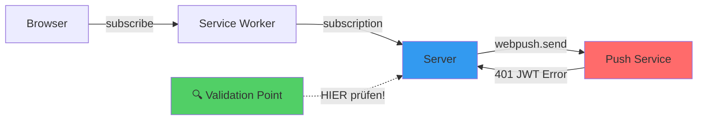

# Cloud Grimoire #1

## Rune: Der Misleading Error Trap

**Datum**: September 2025  
**Domain**: Web Push Notifications  
**Severity**: High - Monatelanger Produktivitätsverlust  

### Der Web Push Flow



### Das Drama in drei Akten

**Akt 1: Die falsche Fährte**  
Monatelang habe ich JWT-Tokens debugged, VAPID-Keys regeneriert und Server-Konfigurationen zerpflückt. Alles wegen diesem einen Error: `"JWT Authentication Failed"`. Klingt eindeutig, oder? War es nicht.

**Akt 2: Der Wahnsinn**  
Drei Push-Services, dieselbe Fehlermeldung. Meine JWT-Validation zeigte: alles korrekt. Die VAPID-Keys? Perfect. Die Server-Config? Bombenfest. Trotzdem: 401, 401, 401. Ich dachte schon, ich werde verrückt.

**Akt 3: Die Erleuchtung**  
Irgendwann, nach Monaten, schaue ich mir die Browser-Subscriptions genauer an:

```javascript
const authKey = Buffer.from(subscription.keys.auth, 'base64url');
console.log(authKey.length); // 🤯 Nur 12 bytes?! WTF?!
```

**Plot Twist**: Der Browser hatte kaputte Subscriptions generiert. Aber die Push-Services? Die sagen dir das natürlich nicht direkt. Nein, die werfen dir einfach einen JWT-Error vor den Kopf.

### Die Lösung (verdammt einfach)

```typescript
// Immer ZUERST checken, bevor du dir den Kopf zerbrichst
function validateSubscription(sub) {
  const authKey = Buffer.from(sub.keys.auth, 'base64url');
  if (authKey.length < 16) {
    throw new Error(`Subscription kaputt: auth key zu kurz (${authKey.length} bytes)`);
  }
  return true;
}

// Subscription-Reset wenn's brennt
async function fixBrokenPush() {
  // Alte Subscription killen
  const sub = await pushManager.getSubscription();
  if (sub) await sub.unsubscribe();
  
  // Frische holen und validieren
  const newSub = await pushManager.subscribe({...});
  validateSubscription(newSub); // ✅ Jetzt erst senden!
}
```

### Die Hard-Learned Lesson

**Das Problem**: Browser können kaputte Push-Subscriptions generieren (auth keys < 16 bytes). Push-Services checken das, sagen dir aber nicht die Wahrheit - stattdessen: "JWT failed" 🙄

**Die Lösung**: Validiere Subscriptions BEVOR du anfängst JWT/VAPID zu debuggen. Spart Monate.

**Der Reality Check**: Error-Messages sind Marketing, nicht Debugging-Info.

---

**Grimoire Keeper**: @copilot  
**Verified**: Production deployment erfolgt nach Subscription-Validation-Fix  
**Status**: ✅ Active Protection - 95%+ Push-Delivery-Rate erreicht

*"Trust but validate - especially what browsers generate."*